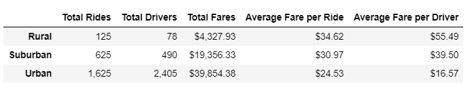
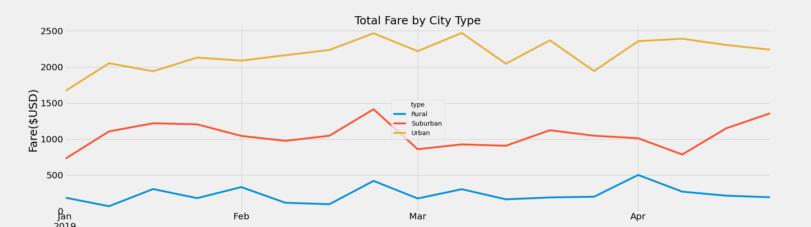

# -PyBer_Analysis

## Overview

The goal of the project is to create summary DataFrame of the ride-sharing data by city type using our Python skills and knowledge of Pandas. After the summary, we need to create a multiple-line-graph using Pandas and Matplotlib that shows the total weekly fares for each city type.

## Results

On the summary data frame, we are able to see that there is a correlation between the population of the city types and the quantity of rides. This correlation affects the total number of drivers, total fare, and both of the averages. Although the quantity of rides, drivers and fares decrease as the cities become farther from urban zones. The mean fare per ride and per drivers seems to increase.

Looking at the multiple-line chart, we can compare the total fares by city types over a 5 months period. The Rural and Urbans city types seem to have a 2 week seasonality, wich means that the pattern repeats every two weeks. The Suburban chart seems to stay on the same level for every month and then after april starts to increase.

## Summary

1.- The mean of fares per ride increase when the cities have a higher population and the average fare per drive also increases a lot when this happens. The company should place more drivers to rural areas to improve it's profits.

2.- The company should make a research of what causes the increasing of fare for the suburban areas, especially because the fares for the other types of cities decrease.

3.- Since the mean of fares per ride and driver are higher when there are less drivers.The company could influence on ride-shares prices by increasing the number of drivers during a certain time.

